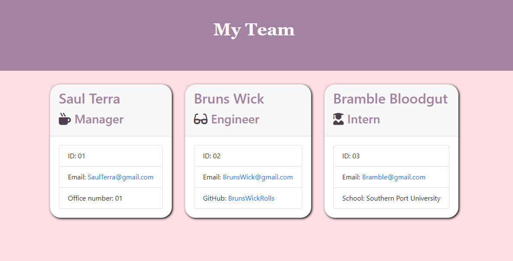

# Employee Manager

## Description
A small command line application that allows the user to input information about each of it's employees in order to generate a page displaying all the basic info about them, such as their name, position, email, id number, and position specific questions. This then generates an html page to neatly and clearly display that information.
  
## Table Of Contents
* [Installation](#Installation)
* [Usage](#Usage)
* [Contributers](#Contributors)
* [Tests](#Tests)
* [License](#License)
* [Questions](#Questions)
  
## Description
You can install it directly thorugh github, then you will want to run npm install in the terminal to install the nesscesities to run the program. To run the program, type 'node index.js' in the terminal to start prompting the user to fill out the forms!
  
## Usage
Used to quickly create html pages of employees on a team.
  
## Contributors
Sami Sully and Georgia Tech Bootcamp Students and Staff for teaching me to write this!

(https://www.github.com/SamiSully)

 HTML, CSS, BOOTSTRAP, JAVASCRIPT, NODE.JS, JQUERY
  
## Tests
Tested multiple times locally generating many different pages for employee teams.
  
## License
MIT License

(https://choosealicense.com/licenses/mit/)

Copyright © Sami Sully 2020
  
## Questions
If you have any questions, you can reach out to me directly at samilsuly@gmail.com
  